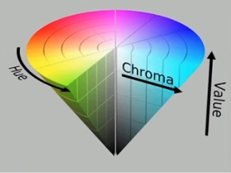
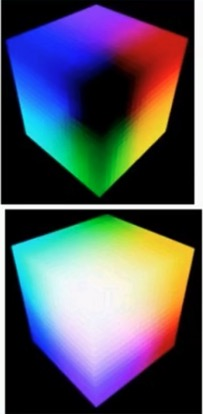
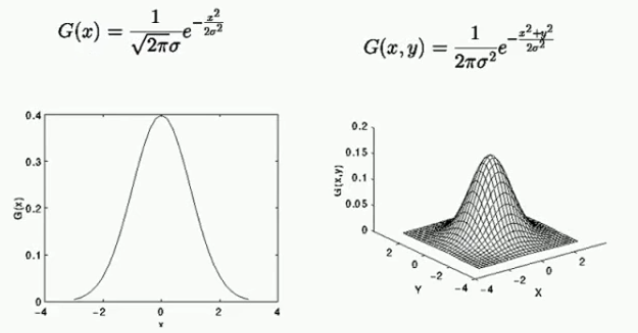
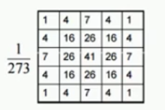
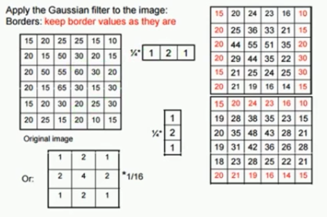

# OpenCv Python Demo

[TOC]

- IDE: PyCharm
- Python: 3.7
- OpenCV: 4.2.0
- Video: https://www.bilibili.com/video/av24998616
- Dependency: 
    - numpy
    - opencv_python
    - opencv_python_headless

## ch3 Color Space

常见的颜色空间：
- RGB (Red Green Blue)
- HSV (Hue Saturation Value)
- HIS
- YCrCb (皮肤检测用的多)
- YUV (linux底层硬件使用，安卓也是)

RGB色彩空间不好表达，HSV的能很好的表述一个颜色。在OpenCV中有一个inRange函数可以很方便的使用HSV来进行颜色识别。

最常见的转换：
1. RGB - HSV
2. RGB - YUV

#### HSV的颜色范围
|  | 黑 | 灰 | 白 | 红 | 红 | 橙 | 黄 | 绿 | 青 | 蓝 | 紫 |
| --- | --- | --- | --- | --- | --- | --- | --- | --- | --- | --- | --- |
| hmin | 0 | 0 | 0 | 0 | 156 | 11 | 26 | 35 | 78 | 100 | 125 |
| hmax | 180 | 180 | 180 | 10 | 180 | 25 | 34 | 77 | 99 | 124 | 155 |
| smin | 0 | 0 | 0 | 43 | 43 | 43 | 43 | 43 | 43 | 43 | 43 |
| smax | 255 | 43 | 30 | 255 | 255 | 255 | 255 | 255 | 255 | 255 | 255 |
| vmin | 0 | 46 | 221 | 46 | 46 | 46 | 46 | 46 | 46 | 46 | 46 |
| vmax | 46 | 220 | 255 | 255 | 255 | 255 | 255 | 255 | 255 | 255 | 255 |

## ch6 blur

这里讲了一下高斯模糊，高斯模糊是opencv中比较常用的一个核（kernel），也有人叫算子。高斯模糊的核符合高斯分布。
下图是一个连续的高斯分布函数：

由于在OpenCV中图片是一个三维矩阵，所以高斯模糊运算用的是离散的算法。下面是一个宽度为5的高斯模糊的kernel：

在进行模糊运算的时候为了效率，底层会将二维高斯矩阵拆成1维高斯矩阵进行运算：

这里原本3x3的矩阵卷积的时候要算9次乘法和一次除法，也就是10次乘法。而拆成两个一维矩阵之后就是三次乘法加一次除法算两遍共合8次乘法，
所以更加高效一些。